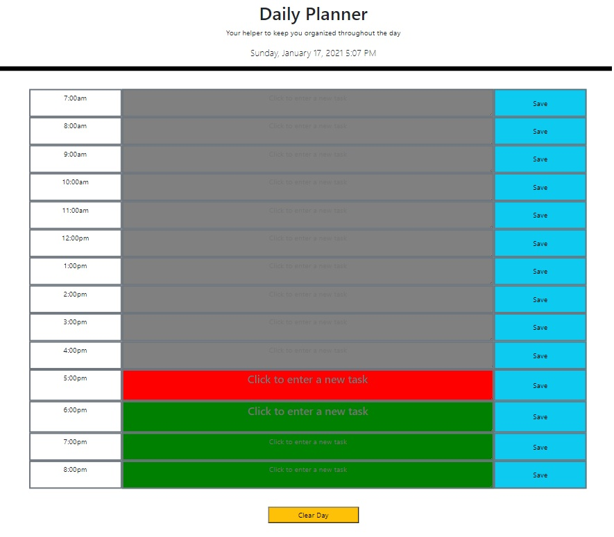

# Daily Planner

​
**Quick Look**


## Description
​
Website for **Daily Planner** was created to keep users on track with smaller details of their day.
​
## What it consists of
The time of available slots ranges from 7am-8pm. You click on the text area to enter a task then click to save task so in case you close browser. This way the page is generated with the tasks you have for the day. It also has a clear button at the bottom for end of day or next day.

### Needs Work
While you can drag and drop it has issues saving it correctly to that new time slot
​
### Dependencies
​* Windows 10
* HTML
* CSS
* Bootstrap
* Momentjs
* Jquery

### Compatibility
* Chrome
* Firefox
* MS Edge
​
### Work with Us
​
* Git Clone if you wish to collaborate 
```
git clone https://github.com/AdamR-Work/daily-planner.git
```
​
### Site location
​
* https://adamr-work.github.io/daily-planner/


​
## Help
​
If you have any questions or concerns contact me at adamrfiles@gmail.com
​
## Authors

* AdamR-Work
​

## Version History
​
*
* 0.1
    * Initial Version
    * See [Commits history](https://github.com/AdamR-Work/daily-planner/commits/main)
​
## License
​
This project is licensed under the AdamR-Work License 
​
